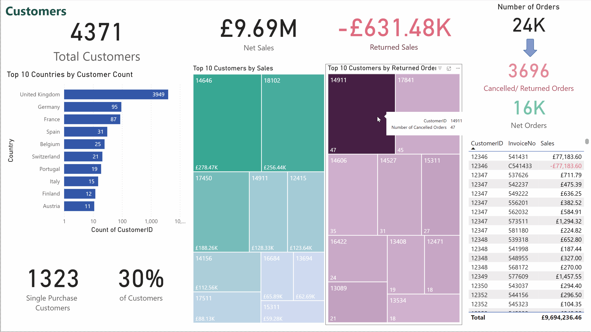

# Online Retail Dataset Analysis
This repository contains an analysis of an Online Retail dataset consisting of transactions from a UK-based online retail store between 2010 and 2011. The goal is to gain insights into the store's sales trends, customer behaviour, and popular products. The analysis was carried out using Python, leveraging libraries such as Pandas, Matplotlib, and Seaborn for data manipulation and visualization. Additionally, Power BI was used to replicate the analysis with interactive dashboards and DAX measures, providing dynamic visual exploration of the data.

## Table of Contents

- [Data Description](#data-description)
- [Analysis Process](#analysis-process)
- [Key Insights](#key-insights)
- [Limitations](#limitations)
- [Conclusion](#conclusion)
- [Power BI Report](#power-bi-report)
- [Technologies Used](#technologies-used)

## Data Description

- Transactions: 500,000+
- The dataset contains the following columns:
  - `InvoiceNo`: Unique identifier for each transaction.
  - `StockCode`: Unique code of the product.
  - `Description`: Description of the product.
  - `Quantity`: Quantity of the product purchased in the transaction.
  - `InvoiceDate`: Date and time of the transaction.
  - `UnitPrice`: Price of the product per unit.
  - `CustomerID`: Unique identifier for the customer.
  - `Country`: Country where the transaction took place.

## Analysis Process

1. **Data Cleaning**

   - Handling missing values (e.g. filling missing `CustomerID` values).
   - Removed irrelevant transactions (e.g. Amazon fee, postage, or adjustments).

2. **Data Transformation**

   - Creating new columns like `Sales`, `Month`, `Day`, `Weekday`, `Hour`, etc.
   - Grouping and aggregating data to understand the sales and customer behaviour patterns.

3. **Exploratory Data Analysis (EDA)**

   - Visualizing sales trends over time.
   - Analyzing the distribution of sales by product, customer, and country.
   - Identified top-selling and most profitable products.
   - Investigating order placement patterns by time of day and day of the week.

## Key Insights

- Sales peaked in **November 2011**, with a notable increase starting from **September 2011**.
- Orders were most frequent between 10AM – 3PM, especially around lunchtime (12–1PM)
- Thursdays had the highest order volume
- Customer ID **14646** generated the most sales for the company.
- **Top Products**:
  - **WORLD WAR 2 GLIDERS ASSTD DESIGNS** was the best-selling product with **53,751 units sold**.
  - **REGENCY CAKESTAND 3 TIER** was the most profitable product, contributing to **1.70%** of total sales.
- Around 30% of customers made only one purchase during the year
- High volume of cancelled/returned orders needs to be accounted for in a deeper analysis

## Limitations

- The dataset only includes transactions up to December 9, 2011, making December sales incomplete and preventing a full comparison with other months.
- There are many cancelled/returned orders in the dataset. Removing these orders and their associated original transactions would provide a more accurate view of genuine purchasing behaviour.

## Conclusion

This analysis provides valuable insights into the purchasing behavior of customers and the sales trends of the products. Key recommendations include:

- Focus on promoting high-sales products like **REGENCY CAKESTAND 3 TIER** to drive revenue.
- Maintain stock levels for best-selling products such as **WORLD WAR 2 GLIDERS ASSTD DESIGNS** to meet customer demand.
- Launch marketing campaigns during **Q4**, when customer activity increases.
- Schedule promotions during peak purchasing hours (10AM to 3PM) for better engagement.
- Implement loyalty programs to encourage repeat purchases.
- Investigate reasons for high cancellation rates to reduce order reversals.

## Power BI Report

In addition to the Python-based analysis, I have built a Power BI report using the same dataset. The report replicates the data modeling, cleaning, and transformation steps performed in Python, including handling missing values and filtering out irrelevant transactions.

Using DAX (Data Analysis Expressions), I created measures to calculate key metrics such as total sales, returned sales, and single-purchase customer counts. The interactive report features visualizations including sales trends over time, top products and customers, hourly and weekday sales patterns, and geographic distribution of customers.

The GIF below demonstrates some of the interactive capabilities, including dynamic filtering and drill-through functionality, enabling users to explore the data in detail and gain deeper insights.

This Power BI report provides an accessible and interactive way to explore the retail data, helping stakeholders gain deeper insights into sales performance and customer behavior.

📄 [View the Power BI PDF report](./online_retail_powerBI_report.pdf)

## Technologies Used

- Python: Pandas, NumPy
- Visualization: Matplotlib, Seaborn & Power BI
- Notebook Environment: Jupyter Notebook (Google Colab)
